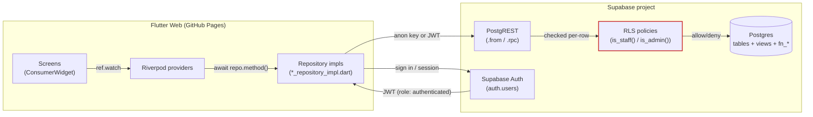
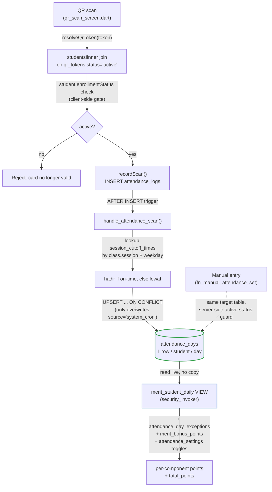
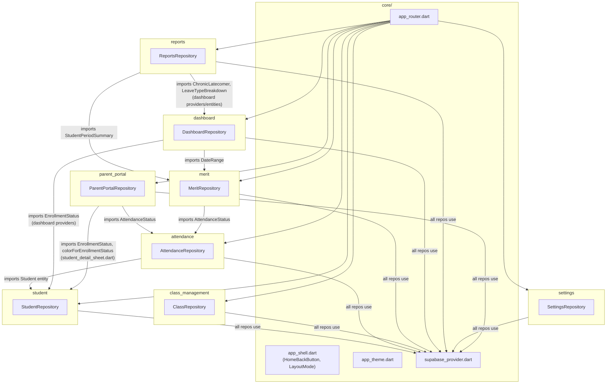
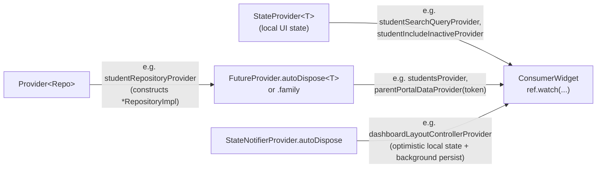
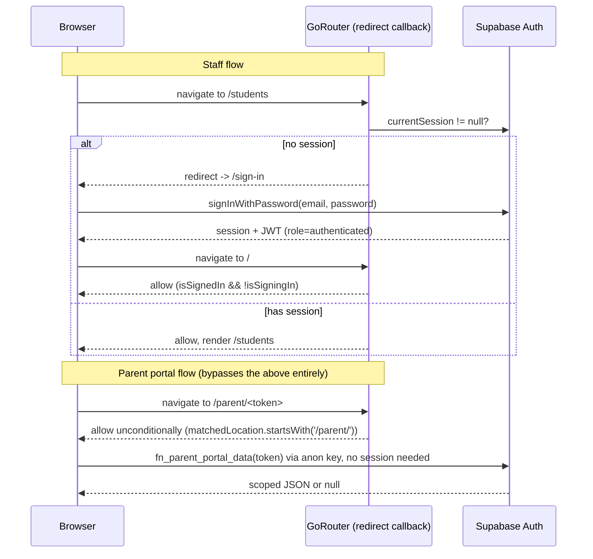
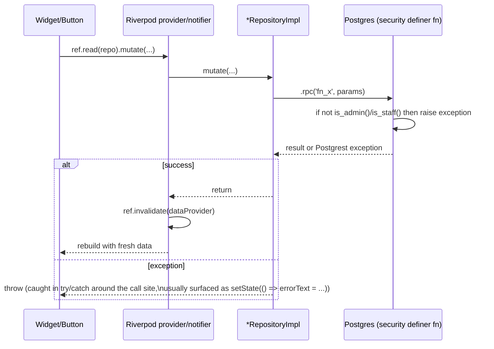

# ARCHITECTURE.md — Dare to Change (D2C)

> How the system is actually wired together. Read `PROJECT.md` first for *why*; this is *how*.

## 1. System Architecture

There is no custom backend server. The Flutter Web client talks directly to Supabase's PostgREST API using either the `anon` key (unauthenticated) or a signed-in user's JWT (`authenticated` role). All authorization is enforced at the database layer — Postgres Row-Level Security (RLS) policies and `security definer` functions — never in client code.



Two access tiers reach the database, and they are enforced *inside Postgres*, not by the client hiding UI:

| Tier | Supabase role | Who | Reaches |
|---|---|---|---|
| Staff | `authenticated`, `profiles` row exists | Signed-in admin/teacher/staff | Everything gated by `is_staff()`/`is_admin()` RLS policies |
| Public | `anon`, no session | Anyone with a parent-portal link | Only `fn_parent_portal_data(token)`, scoped to one student |

## 2. Data Flow: the attendance pipeline (the mechanism worth understanding first)

This is the one flow every other feature depends on, and it is **not** a single write — a scan produces two table writes chained by a DB trigger, and a third table (`merit_student_daily`) reads the result live, with no data duplicated between them.



Key invariants (do not break these while editing attendance code):
- `attendance_logs` is **append-only** — nothing updates or deletes rows there.
- `attendance_days` has a `unique (student_id, school_date)` constraint; the trigger's `ON CONFLICT ... DO UPDATE ... WHERE source = 'system_cron'` means a scan or manual entry **never silently overwrites** an existing scan or manual override for that day — only a cron-placeholder gets replaced.
- `merit_student_daily` has **no stored data of its own** — every merit number in the app is computed from this view at query time. There is no "recalculate merit" operation because nothing is cached.

## 3. Module Relationships



Every feature depends on `core/providers/supabase_provider.dart` for its `SupabaseClient`. Cross-feature dependencies only ever go **one direction** — a feature imports another's `domain/entities` (never its `presentation` layer, with the sole documented exception of `colorForEnrollmentStatus`, a top-level function reused by `parent_portal` from `student/presentation/screens/student_detail_sheet.dart`; see `COMPONENTS.md`). There is no dependency-injection container — Riverpod's `Provider` graph *is* the DI mechanism.

## 4. Service / Repository Layer

Every feature has exactly one repository interface (`domain/repositories/<feature>_repository.dart`) and one implementation (`data/repositories/<feature>_repository_impl.dart`). The pattern is uniform:

```dart
abstract interface class FooRepository {
  Future<List<Foo>> getFoos();
}

class FooRepositoryImpl implements FooRepository {
  FooRepositoryImpl({SupabaseClient? client}) : _client = client ?? Supabase.instance.client;
  final SupabaseClient _client;

  @override
  Future<List<Foo>> getFoos() async {
    final rows = await _client.from('foos').select();
    return rows.map((row) => Foo.fromMap(row)).toList();
  }
}
```

Two write patterns coexist, chosen per-case, not uniformly:

| Pattern | When | Example |
|---|---|---|
| Direct `.from(table).insert/update/delete()` | Simple CRUD already covered by table RLS, no cross-table logic | `student_guardians` add/edit/delete (`StudentRepositoryImpl.addGuardian`) |
| `.rpc('fn_name', params: {...})` | Any logic beyond a single-table write: cutoff-time computation, cross-table aggregation, privilege escalation (security definer), or anything an `anon` caller needs | `fn_manual_attendance_set`, `fn_update_student_status`, `fn_parent_portal_data` |

**Rule of thumb**: if you're tempted to compute something across rows in Dart after fetching a list, write a SQL function instead. No feature repository does client-side aggregation of multi-row data.

## 5. State Management (Riverpod)

No code generation (`riverpod_generator` is not used) — every provider is hand-written. Four provider shapes cover the whole app:



- **Read path**: a screen's `build()` calls `ref.watch(someFutureProvider(args))`, gets an `AsyncValue<T>`, and branches on `.when(data:, loading:, error:)`.
- **Write path**: a button handler calls `ref.read(repositoryProvider).mutatingMethod(...)`, then `ref.invalidate(theFutureProvider)` (or the `.family` instance) to force a refetch. There is no cache-patching — every write is followed by a full refetch of whatever providers show that data.
- **`.autoDispose`** is used on almost every data provider so screens don't leak state after navigating away; the few that aren't (`themeModeProvider`, `layoutModeProvider`) are intentionally app-lifetime singletons.
- **`StateNotifierProvider`** is used exactly once (`DashboardLayoutController`) — for the one case needing optimistic local mutation (instant drag-reorder feedback) *plus* background server persistence that shouldn't block the UI.

## 6. Dependency Injection

There is no DI framework. Riverpod's provider graph **is** the injection mechanism:
- `supabaseClientProvider` (in `core/providers/supabase_provider.dart`) is the one true source of a `SupabaseClient`.
- Every `<Feature>RepositoryImpl` is constructed inside a `Provider<FooRepository>((ref) => FooRepositoryImpl(client: ref.watch(supabaseClientProvider)))`.
- Every repository constructor also accepts an optional `SupabaseClient? client` param defaulting to `Supabase.instance.client` — this exists so a test *could* inject a fake client, though no test currently does.
- Widgets never construct a repository directly; they always go through `ref.watch(fooRepositoryProvider)`.

## 7. Authentication Flow

Two distinct flows coexist in one router, gated by a single `redirect` callback.



`app_router.dart`'s `redirect` callback, in order:
1. `if (state.matchedLocation.startsWith('/parent/')) return null;` — **always** allowed, regardless of staff session state. This must stay first in the chain.
2. `if (!isSignedIn) return isSigningIn ? null : '/sign-in';`
3. `if (isSignedIn && isSigningIn) return '/';`
4. else `return null;`

`GoRouterRefreshStream` bridges Supabase's `auth.onAuthStateChange` stream into a `Listenable` so the router re-evaluates `redirect` the moment a session appears/disappears (no manual navigation call needed after sign-in/sign-out).

Staff roles (`profiles.role`): `admin`, `teacher`, `staff`. Two Postgres helper functions gate almost every RLS policy and are the actual enforcement point (the Dart client has **no** role-based UI hiding that isn't backed by one of these):
- `is_staff()` — `true` if a `profiles` row exists for `auth.uid()` (any role).
- `is_admin()` — `true` only if that row's `role = 'admin'`.

## 8. API / RPC Flow

Every RPC call from Dart follows the same shape: `await _client.rpc('fn_name', params: {...})`. See `API.md` for every function's full contract. The general request lifecycle:



Error surfacing convention: dialogs wrap the mutating call in `try { ... } catch (error) { setDialogState(() => errorText = 'Failed to X: $error'); }` — the raw Postgrest/Supabase exception message is shown verbatim to the user inside the dialog. There is no error-code translation layer; the SQL function's `raise exception 'message: %', val` text *is* what the staff member sees.

## 9. Error Handling Strategy

| Layer | Strategy |
|---|---|
| SQL functions | `raise exception 'descriptive message'` for anything that should hard-fail (wrong role, invalid enum value, inactive student). No custom error codes — message text is the contract. |
| RLS | Silent filtering for `SELECT` (a disallowed row just doesn't appear); a blocked `INSERT`/`UPDATE`/`DELETE` raises a generic Postgres RLS violation, surfaced to Dart as a `PostgrestException`. |
| Repository layer | No try/catch — exceptions propagate to the caller untouched. |
| Provider layer | `FutureProvider` naturally wraps a thrown exception into `AsyncValue.error`, handled by the widget's `.when(error: (e, st) => Text('Failed to load: $e'))`. |
| Dialog/mutation call sites | Explicit `try/catch` around the single `.rpc()`/`.insert()` call, error text shown inline in the dialog (never a separate error screen/toast for form-validation-style failures). |
| Client-side guards | A few "reject before hitting the server" checks exist for UX speed (e.g., `qr_scan_screen.dart` checking `student.enrollmentStatus != EnrollmentStatus.active` before calling `recordScan`) — these are **not** the security boundary; the server-side check (`fn_manual_attendance_set`'s active-status guard) is. Never rely on a client-side check alone for anything security-sensitive. |

There is no centralized logging/crash-reporting SDK wired in (no Sentry/Crashlytics). Errors are visible only via the browser console and whatever the UI surfaces inline.
