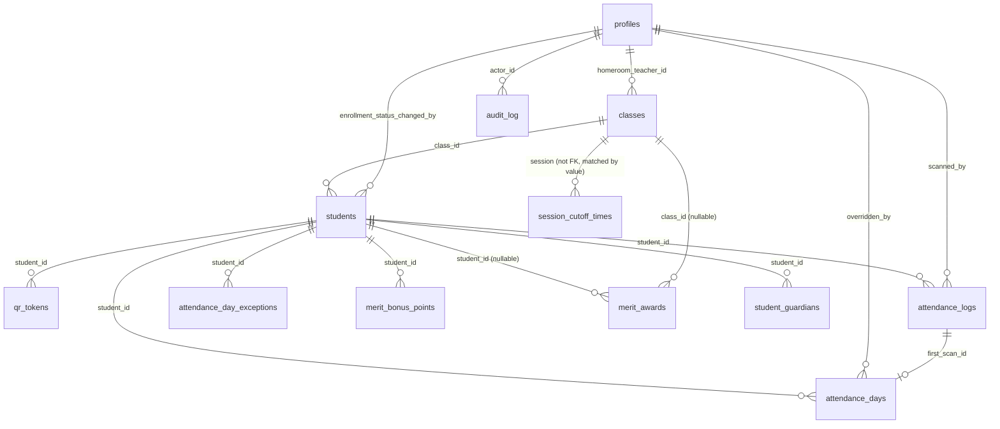

# DATABASE.md — Dare to Change (D2C)

> Full schema reference. Source of truth is `supabase/migrations/*.sql`, applied chronologically — this document is a synthesized snapshot of the schema **after all migrations** (`20260728000001` through `20260811000006`). If you add a migration, update this file in the same commit.

No local Postgres/Docker is used in this project. Every migration is applied with `supabase db push` (targets the linked production project directly) and verified with `supabase db query --linked "<sql>"`. There is no staging database.

## Table of Contents
- [Entity-Relationship Overview](#entity-relationship-overview)
- Tables: [profiles](#profiles) · [classes](#classes) · [students](#students) · [qr_tokens](#qr_tokens) · [attendance_settings](#attendance_settings) · [attendance_logs](#attendance_logs) · [attendance_days](#attendance_days) · [audit_log](#audit_log) · [attendance_day_exceptions](#attendance_day_exceptions) · [merit_bonus_points](#merit_bonus_points) · [merit_awards](#merit_awards) · [session_cutoff_times](#session_cutoff_times) · [student_guardians](#student_guardians) · [discipline_records](#discipline_records) · [counseling_records](#counseling_records) · [student_voice_submissions](#student_voice_submissions)
- [Views](#views)
- [Functions](#functions-fn_-and-helpers)
- [Triggers](#triggers)
- [Storage Buckets](#storage-buckets)
- [RLS Policy Summary](#rls-policy-summary-by-table)
- [Migration History](#migration-history-chronological)
- [Future Migration Notes](#future-migration-notes)

## Entity-Relationship Overview



`merit_student_daily` (a view, not a table) is not shown above — it has no FK relationships of its own; it's a live computed join of `attendance_days` + `students` + `attendance_day_exceptions` + `merit_bonus_points` + `attendance_settings`.

---

## Tables

### `profiles`
**Purpose**: One row per staff member (admin/teacher/staff), 1:1 with `auth.users`. This is the *only* table that represents a logged-in identity — parents/students have no `auth.users`/`profiles` row (see Parent Portal, which is deliberately unauthenticated).

| Column | Type | Constraints | Notes |
|---|---|---|---|
| `id` | uuid | PK, `references auth.users(id) on delete cascade` | Same UUID as the Supabase Auth user |
| `full_name` | text | not null | |
| `role` | text | not null, default `'teacher'`, `check (role in ('admin','teacher','staff'))` | Drives `is_admin()`/`is_staff()` |
| `dashboard_layout` | jsonb | nullable | Added in `20260808000001`. `{"stats": [...ids], "charts": [...ids]}`. Null = use default order. Written only via `fn_update_dashboard_layout` |
| `created_at`, `updated_at` | timestamptz | not null, default `now()` | `updated_at` maintained by `touch_updated_at()` trigger |

**Indexes**: PK on `id` (implicit).
**Trigger**: `profiles_touch_updated_at` (before update).
**RLS**: enabled.
- `profiles_select_self_or_admin`: `select` where `id = auth.uid() or is_admin()`.
- `profiles_admin_write`: `for all` where `is_admin()`. **Non-admin staff cannot write their own profile row directly** — this is why `dashboard_layout` needed a dedicated security-definer RPC (`fn_update_dashboard_layout`) instead of a direct client update.

---

### `classes`
**Purpose**: One row per class (e.g. "1 CITRA"), sourced from the school's SIS export (XEA4402). Effectively read-only from the app — no create/edit/delete UI exists.

| Column | Type | Constraints | Notes |
|---|---|---|---|
| `id` | uuid | PK, default `gen_random_uuid()` | |
| `name` | text | not null, unique | e.g. `"1 CITRA"` |
| `form_level` | smallint | not null, `check (between 1 and 6)` | Tingkatan 1-5 in practice (6 allowed by constraint, unused) |
| `homeroom_teacher_name` | text | nullable | Raw name from SIS export, kept even before that teacher has a login |
| `homeroom_teacher_id` | uuid | nullable, `references profiles(id) on delete set null` | Linked once the teacher has a `profiles` row |
| `session` | text | not null, default `'pagi'`, `check (in ('pagi','petang'))` | Added `20260802000001`. Forms 1-2 = `petang`, Forms 3-5 = `pagi` |
| `created_at`, `updated_at` | timestamptz | not null | |

**Trigger**: `classes_touch_updated_at`.
**RLS**: enabled. `classes_select_staff` (`is_staff()`), `classes_admin_write` (`is_admin()`, `for all`).

---

### `students`
**Purpose**: One row per student, sourced from XEA4402 (`student_id` = "ID MURID", the authoritative external key). Extended twice: once for enrollment status (discipline/transfer/graduation tracking), never for guardian info (that's a separate table).

| Column | Type | Constraints | Notes |
|---|---|---|---|
| `id` | uuid | PK, default `gen_random_uuid()` | Internal key, used everywhere else as FK |
| `student_id` | bigint | not null, unique | External "ID MURID" |
| `full_name` | text | not null | |
| `ic_number`, `ic_type` | text | nullable | |
| `date_of_birth` | date | nullable | |
| `gender` | text | nullable, `check (in ('LELAKI','PEREMPUAN'))` | |
| `study_status` | text | not null, default `'BERSEKOLAH'` | Raw MOE "STATUS PENGAJIAN" field — **unconstrained free text, distinct from `enrollment_status` below; do not conflate the two** |
| `enrolled_at`, `class_joined_at` | date | nullable | |
| `class_id` | uuid | nullable, `references classes(id) on delete set null` | |
| `enrollment_status` | text | not null, default `'active'`, `check (in ('active','suspended','expelled','transferred_out','withdrawn','deceased','graduated'))` | Added `20260809000001`. The app-level status (see `PROJECT.md` design decision #4) |
| `enrollment_status_reason` | text | nullable | |
| `enrollment_status_date` | date | nullable | Effective date of the status change |
| `enrollment_status_changed_by` | uuid | nullable, `references profiles(id) on delete set null` | |
| `enrollment_status_changed_at` | timestamptz | nullable | |
| `created_at`, `updated_at` | timestamptz | not null | |

**Indexes**: `students_class_id_idx`, `students_full_name_idx`, `students_enrollment_status_idx`.
**Trigger**: `students_touch_updated_at`.
**RLS**: enabled. `students_select_staff` (`is_staff()`), `students_admin_write` (`is_admin()`, `for all` — **direct writes are admin-only**; enrollment status changes go through `fn_update_student_status` instead, which is also admin-gated but records an audit trail of who/when).

---

### `qr_tokens`
**Purpose**: Physical QR card tokens. At most one `active` token per student at any time (partial unique index, not a plain unique constraint).

| Column | Type | Constraints | Notes |
|---|---|---|---|
| `id` | uuid | PK | |
| `student_id` | uuid | not null, `references students(id) on delete cascade` | |
| `token` | text | not null, unique | The literal QR code payload |
| `status` | text | not null, default `'active'`, `check (in ('active','revoked','reissued'))` | |
| `printed_class_snapshot` | text | nullable | Class printed on the card at issue time, for reconciling later class reassignments |
| `issued_at`, `revoked_at`, `created_at` | timestamptz | | |

**Indexes**: `qr_tokens_one_active_per_student` — **unique index on `student_id` WHERE `status = 'active'`** (partial index; this is how "at most one active token" is enforced, not a table-level constraint). `qr_tokens_token_idx`.
**RLS**: enabled.
- `qr_tokens_select_staff`: any staff can look up a token to resolve a scan.
- `qr_tokens_staff_insert` / `qr_tokens_staff_update`: any staff (changed from admin-only in `20260729000001` — registering/reissuing cards is a routine teacher task).
- `qr_tokens_admin_delete`: admin only.

---

### `attendance_settings`
**Purpose**: Singleton config row (`id` fixed to `1`). Program period, timezone, and per-component merit toggles.

| Column | Type | Constraints | Notes |
|---|---|---|---|
| `id` | smallint | PK, default `1`, `check (id = 1)` | Enforces singleton |
| `school_timezone` | text | not null, default `'Asia/Kuala_Lumpur'` | |
| `program_start_date`, `program_end_date` | date | not null, defaults `2026-08-01`/`2026-10-31` | Added `20260730000001`. The D2C program window |
| `merit_enable_hadir` | boolean | not null, default `true` | |
| `merit_enable_tepat_masa` | boolean | not null, default `true` | |
| `merit_enable_kembali_rehat` | boolean | not null, default `false` | Off by default — "hard to verify reliably in practice" |
| `merit_enable_kekal_sesi` | boolean | not null, default `true` | |
| `merit_enable_bonus` | boolean | not null, default `false` | |
| `merit_max_points` | smallint | not null, default `4` | Max achievable per day. Independent of which components are enabled |
| `updated_at` | timestamptz | not null | |

Note: `cutoff_time` (original single-value column) was **dropped** in `20260802000001`, superseded by `session_cutoff_times` (per-session, per-weekday cutoffs).

**Trigger**: `attendance_settings_touch_updated_at`.
**RLS**: enabled. `attendance_settings_select_staff`, `attendance_settings_admin_write` (`for all`).

---

### `attendance_logs`
**Purpose**: Append-only raw QR scan events. Source of truth for "a scan happened"; never updated or deleted.

| Column | Type | Constraints | Notes |
|---|---|---|---|
| `id` | uuid | PK | |
| `student_id` | uuid | not null, `references students(id) on delete cascade` | |
| `scanned_at` | timestamptz | not null, default `now()` | |
| `scanned_by` | uuid | nullable, `references profiles(id) on delete set null` | |
| `device_label` | text | nullable | |
| `created_at` | timestamptz | not null | |

**Indexes**: `attendance_logs_student_id_idx`, `attendance_logs_scanned_at_idx`.
**RLS**: enabled. `attendance_logs_select_staff`, `attendance_logs_insert_staff` (any staff can log a scan). **No update/delete policy exists** — those operations are denied by default (RLS default-deny).
**Trigger fired FROM this table**: `attendance_logs_after_insert` → `handle_attendance_scan()` (see [Triggers](#triggers)).

---

### `attendance_days`
**Purpose**: Canonical one-row-per-student-per-school-day status. This is *the* table almost everything else reads from.

| Column | Type | Constraints | Notes |
|---|---|---|---|
| `id` | uuid | PK | |
| `student_id` | uuid | not null, `references students(id) on delete cascade` | |
| `school_date` | date | not null | |
| `status` | text | not null, `check (in ('hadir','lewat','tidak_hadir','cuti_sakit','urusan_rasmi'))` | |
| `source` | text | not null, default `'qr_scan'`, `check (in ('qr_scan','system_cron','manual_override'))` | `system_cron` is modeled but **no cron job populates it yet** — see `KNOWN_ISSUES.md` |
| `first_scan_id` | uuid | nullable, `references attendance_logs(id) on delete set null` | |
| `first_scan_at` | timestamptz | nullable | |
| `overridden_by` | uuid | nullable, `references profiles(id) on delete set null` | |
| `override_reason` | text | nullable | |
| `created_at`, `updated_at` | timestamptz | not null | |
| — | — | **`unique (student_id, school_date)`** | The upsert target for the scan trigger and manual entry |

**Indexes**: `attendance_days_school_date_idx`, `attendance_days_student_id_idx`.
**Trigger**: `attendance_days_touch_updated_at`; also the **target** of `attendance_days_audit` (see Triggers).
**RLS**: enabled. `attendance_days_select_staff`. `attendance_days_admin_write` (`for all`, admin only) — **direct writes are admin-only**; the actual write paths for everyone else are the scan trigger (fires as the trigger owner, bypasses this) and `fn_manual_attendance_set` (security definer, staff-gated internally).

---

### `audit_log`
**Purpose**: Generic append-only audit trail. Currently populated only by `attendance_days` status changes.

| Column | Type | Constraints | Notes |
|---|---|---|---|
| `id` | uuid | PK | |
| `actor_id` | uuid | nullable, `references profiles(id) on delete set null` | |
| `action` | text | not null | e.g. `'attendance_status_change'` |
| `table_name` | text | not null | |
| `record_id` | uuid | not null | |
| `before`, `after` | jsonb | nullable | Full row snapshots via `to_jsonb(old/new)` |
| `created_at` | timestamptz | not null | |

**Index**: `audit_log_table_record_idx (table_name, record_id)`.
**RLS**: enabled. `audit_log_select_admin` only — **no insert policy for the app**; only populated by the `attendance_days_audit` trigger, which runs as its function owner (bypasses RLS by nature of trigger execution context).

---

### `attendance_day_exceptions`
**Purpose**: Staff-recorded exceptions to the *default-earned* merit points 2-4 (late to class, missed recess return, left early). **No row = all flags false = all points earned** — this table only ever records a deviation, never a confirmation.

| Column | Type | Constraints | Notes |
|---|---|---|---|
| `id` | uuid | PK | |
| `student_id` | uuid | not null, `references students(id) on delete cascade` | |
| `school_date` | date | not null | |
| `late_to_class` | boolean | not null, default `false` | Added `20260731000002`. Point 2 ("masuk kelas tepat masa") — deliberately independent of morning arrival time |
| `missed_recess_return` | boolean | not null, default `false` | Point 3 |
| `left_early` | boolean | not null, default `false` | Point 4 |
| `noted_by` | uuid | nullable, `references profiles(id) on delete set null` | |
| `noted_at`, `created_at`, `updated_at` | timestamptz | not null | |
| — | — | `unique (student_id, school_date)` | |

**Index**: `attendance_day_exceptions_school_date_idx`.
**Trigger**: `attendance_day_exceptions_touch_updated_at`.
**RLS**: enabled. `select`/`insert`/`update` for any staff; `delete` admin only.

---

### `merit_bonus_points`
**Purpose**: Ad hoc bonus points (opt-in via `attendance_settings.merit_enable_bonus`).

| Column | Type | Constraints | Notes |
|---|---|---|---|
| `id` | uuid | PK | |
| `student_id` | uuid | not null, `references students(id) on delete cascade` | |
| `school_date` | date | not null | |
| `points` | smallint | not null, `check (points > 0)` | |
| `reason` | text | nullable | |
| `awarded_by` | uuid | nullable, `references profiles(id) on delete set null` | |
| `awarded_at` | timestamptz | not null | |

**Index**: `merit_bonus_points_student_date_idx (student_id, school_date)`.
**RLS**: enabled. Staff can `select`/`insert`; `update`/`delete` are admin only.

---

### `merit_awards`
**Purpose**: Log of recognition actually handed out (rewards screen's "Log Award"). Never auto-awarded — a deliberate manual action.

| Column | Type | Constraints | Notes |
|---|---|---|---|
| `id` | uuid | PK | |
| `category` | text | not null, `check (in ('full_weekly_attendance','full_monthly_attendance','individual_improvement','most_improved_class','best_transition','highest_merit_class'))` | |
| `scope_type` | text | not null, `check (in ('student','class'))` | |
| `student_id` | uuid | nullable, `references students(id) on delete cascade` | |
| `class_id` | uuid | nullable, `references classes(id) on delete cascade` | |
| `period_start`, `period_end` | date | not null | |
| `awarded_by` | uuid | nullable, `references profiles(id) on delete set null` | |
| `awarded_at` | timestamptz | not null | |
| `note` | text | nullable | |
| — | — | `check ((scope_type='student' and student_id is not null and class_id is null) or (scope_type='class' and class_id is not null and student_id is null))` | Exactly one of `student_id`/`class_id` per row |

**Index**: `merit_awards_category_period_idx (category, period_start, period_end)`.
**Unique index**: `merit_awards_dedupe_idx` on `(category, scope_type, coalesce(student_id, class_id), period_start, period_end)` — **must use `coalesce`**, not a plain multi-column unique, because standard SQL treats each `NULL` as distinct and exactly one of `student_id`/`class_id` is always `NULL` (added `20260731000001` specifically to fix double-logging of the same award).
**RLS**: enabled. Staff `select`/`insert`; `delete` admin only. **No update policy** — awards are immutable once logged (only insert/delete).

---

### `session_cutoff_times`
**Purpose**: Per-session (`pagi`/`petang`), per-ISO-weekday on-time cutoff. Replaces the old single `attendance_settings.cutoff_time`.

| Column | Type | Constraints | Notes |
|---|---|---|---|
| `session` | text | `check (in ('pagi','petang'))` | Part of composite PK |
| `day_of_week` | smallint | `check (between 1 and 7)` | ISO weekday, 1=Monday. Part of composite PK |
| `cutoff_time` | time | not null | |
| — | — | PK `(session, day_of_week)` | |

Seeded values: `petang` Mon-Thu `12:05:00`, Fri `13:30:00`; `pagi` Mon-Fri `07:00:00`. No Sat/Sun rows (a weekend scan falls through to `lewat` by the trigger's null-cutoff fallback).
**RLS**: enabled. `select` staff; `for all` admin.

---

### `student_guardians`
**Purpose**: Parent/guardian contact records, one row per guardian per student (a guardian with two children at the school gets two rows — no cross-student guardian entity). Bulk-imported from XEA4402's PENJAGA 1/2 blocks (see `scripts/generate_guardian_seed_sql.py`); also editable by any staff via the Student Detail sheet.

| Column | Type | Constraints | Notes |
|---|---|---|---|
| `id` | uuid | PK | |
| `student_id` | uuid | not null, `references students(id) on delete cascade` | |
| `full_name` | text | not null | |
| `relationship` | text | nullable | Free text, e.g. `BAPA KANDUNG`, `IBU KANDUNG`, or user-entered `Bapa`/`Ibu`/`Penjaga` |
| `ic_number` | text | nullable | Added `20260810000001` |
| `phone` | text | nullable | Mobile preferred over office phone at import time |
| `email` | text | nullable | Never populated by the import (source has no email field) |
| `is_primary` | boolean | not null, default `false` | |
| `is_emergency_contact` | boolean | not null, default `false` | |
| `notes` | text | nullable | |
| `access_token` | uuid | not null, default `gen_random_uuid()`, **unique** | Added `20260811000001`. The Parent Portal link secret: `/parent/<access_token>` |
| `created_at`, `updated_at` | timestamptz | not null | |
| — | — | **unique `(student_id, full_name)`** | Added `20260810000001` — makes the bulk import idempotent (`on conflict ... do update`) |

**Index**: `student_guardians_student_id_idx`.
**Trigger**: `student_guardians_touch_updated_at`.
**RLS**: enabled. `student_guardians_select_staff` and `student_guardians_write_staff` (`for all`) — **both gated on `is_staff()`, not `is_admin()`** — any signed-in staff member can add/edit/delete a guardian record; this is deliberately less restrictive than `students`/`attendance_days` writes (routine contact upkeep, not disciplinary data).

---

## Views

### `merit_student_daily`
**Purpose**: The single source of merit data for the entire app. A live-computed `security_invoker` view — no stored merit ledger exists anywhere.

```
select
  ad.student_id, ad.school_date, s.class_id, s.full_name,
  ad.status as attendance_status,
  point_hadir, point_tepat_masa, point_kembali_rehat, point_kekal_sesi, bonus,
  total_points
from attendance_days ad
join students s on s.id = ad.student_id
cross join attendance_settings cfg          -- per-component enable toggles
left join attendance_day_exceptions e on (student_id, school_date) match
left join (merit_bonus_points grouped by student_id, school_date) b
```

Each `point_*` column reads `0` if that component is disabled in `attendance_settings` (`cfg.merit_enable_*`), **regardless of the underlying exception/bonus data** — disabling a component zeroes it out entirely rather than partially honoring recorded exceptions.

**`security_invoker = true` is mandatory** on this view — without it, the view would run under the view *owner's* privileges (bypassing RLS), meaning every staff member would see every student's data regardless of the underlying `attendance_days`/`students` RLS policies. If you ever `create or replace view public.merit_student_daily`, you **must** re-specify `with (security_invoker = true)` or you silently reintroduce a data-leak.

`grant select on merit_student_daily to authenticated` — readable by any signed-in staff (RLS on the underlying tables still applies per-row via the invoker's own permissions).

---

## Functions (`fn_*` and helpers)

All functions are `language sql stable` (pure reads) unless noted `plpgsql`/`security definer` (writes or privilege escalation). Full request/response contracts are in `API.md`; this is the inventory.

| Function | Returns | Security | Grant | Purpose |
|---|---|---|---|---|
| `is_admin()` | boolean | definer, stable | (internal) | `role = 'admin'` check |
| `is_staff()` | boolean | definer, stable | (internal) | any `profiles` row exists |
| `touch_updated_at()` | trigger | invoker | (trigger only) | sets `NEW.updated_at = now()` |
| `audit_attendance_days_change()` | trigger | definer | (trigger only) | logs status changes to `audit_log` |
| `handle_attendance_scan()` | trigger | definer | (trigger only) | derives `attendance_days` from a new `attendance_logs` row |
| `fn_student_period_summary(from, to, class_id?)` | table | invoker, stable | authenticated | per-student totals over a range, elapsed-days denominator, excludes non-active students |
| `fn_class_period_summary(from, to)` | table | invoker, stable | authenticated | per-class totals + missed-recess-return rate, excludes non-active students |
| `fn_weekly_kpi_trend(from, to, session?)` | table | invoker, stable | authenticated | ISO-week-grouped attendance rate / late count / repeat-absence count |
| `fn_upsert_staff_by_email(email, full_name, role)` | `profiles` row | definer | authenticated | admin-only staff account grant, looks up `auth.users` by email server-side |
| `fn_manual_attendance_set(student_id, school_date, status, time?, note?)` | void | definer | authenticated | manual/backfill attendance write; **rejects non-active students server-side** |
| `fn_attendance_day_summary(date)` | table (1 row) | invoker, stable | authenticated | present/late/absent/mc counts + merit points + rewards for one day |
| `fn_daily_attendance_trend(from, to)` | table | invoker, stable | authenticated | one row per recorded school day, powers trend line + heatmap |
| `fn_daily_merit_trend(from, to)` | table | invoker, stable | authenticated | total merit points per day |
| `fn_class_attendance_summary(from, to)` | table | invoker, stable | authenticated | per-class attendance rate; `left join` preserves classes with 0 records (powers "missing attendance today" banner) |
| `fn_attendance_streaks(limit=10)` | table | invoker, stable | authenticated | consecutive present-day streak per student |
| `fn_recent_activity(limit=15)` | table | invoker, stable | authenticated | merged scan/manual/award timeline; **does not** filter by enrollment status (audit-log semantics) |
| `fn_kpi_overview(from, to)` | table (1 row) | invoker, stable | authenticated | attendance rate, avg merit %, discipline rate |
| `fn_weekday_count(from, to)` | int | invoker, stable | authenticated | count of Mon-Fri days in a range (helper for period-summary denominators) |
| `fn_attendance_period_summary(reference_date)` | table | invoker, stable | authenticated | day/week/month/year rates at school/form/class scope; **fixed-period** denominator (see `PROJECT.md` #3) |
| `fn_chronic_latecomers(reference_date, window_days=7, min_late=3)` | table | invoker, stable | authenticated | students with ≥N `lewat` days in a trailing window |
| `fn_leave_type_breakdown(from, to)` | table (1 row) | invoker, stable | authenticated | counts of `tidak_hadir`/`cuti_sakit`/`urusan_rasmi` in a range |
| `fn_update_dashboard_layout(layout jsonb)` | void | definer | authenticated | writes `profiles.dashboard_layout` for `auth.uid()` (bypasses admin-only profile RLS) |
| `fn_update_student_status(student_id, status, reason?, date?)` | void | definer | authenticated | admin-only enrollment status change, records who/when |
| `fn_regenerate_guardian_token(guardian_id)` | uuid | definer | authenticated | staff-only, issues a new `access_token`, invalidating the old parent-portal link |
| `fn_parent_portal_data(token)` | jsonb | definer, plpgsql | **anon, authenticated** | the only function reachable without a session; returns null for an invalid token, otherwise one student's scoped status |

**Note on `security invoker` (the SQL-language function default) vs `security definer`**: every read-only `fn_*` above is a plain `language sql` function, which is `security invoker` by default in Postgres — it runs under the *calling* user's RLS, meaning these functions do **not** bypass RLS; they simply package a query. Only the `plpgsql` functions explicitly marked `security definer` (`is_admin`, `is_staff`, the two trigger functions, `fn_upsert_staff_by_email`, `fn_manual_attendance_set`, `fn_update_dashboard_layout`, `fn_update_student_status`, `fn_regenerate_guardian_token`, `fn_parent_portal_data`) run with elevated privilege and therefore **must** contain their own internal authorization check (`if not is_admin()/is_staff() then raise exception`) — this is the actual security boundary for those functions, not RLS.

---

## Triggers

| Trigger | Table | Timing | Function | Effect |
|---|---|---|---|---|
| `profiles_touch_updated_at` | `profiles` | before update | `touch_updated_at()` | maintain `updated_at` |
| `classes_touch_updated_at` | `classes` | before update | `touch_updated_at()` | " |
| `students_touch_updated_at` | `students` | before update | `touch_updated_at()` | " |
| `attendance_settings_touch_updated_at` | `attendance_settings` | before update | `touch_updated_at()` | " |
| `attendance_days_touch_updated_at` | `attendance_days` | before update | `touch_updated_at()` | " |
| `attendance_day_exceptions_touch_updated_at` | `attendance_day_exceptions` | before update | `touch_updated_at()` | " |
| `student_guardians_touch_updated_at` | `student_guardians` | before update | `touch_updated_at()` | " |
| `attendance_days_audit` | `attendance_days` | after update | `audit_attendance_days_change()` | if `status` changed, insert an `audit_log` row with before/after snapshots |
| `attendance_logs_after_insert` | `attendance_logs` | after insert | `handle_attendance_scan()` | **the core pipeline** — derives session/weekday cutoff, computes `hadir`/`lewat`, upserts `attendance_days` (only overwriting a `system_cron`-sourced row) |

## Storage Buckets

**None.** No Supabase Storage bucket is used anywhere in this project. The one static asset (`assets/images/crest.png`, the school crest) is bundled into the Flutter web build, not stored in Supabase. If a future feature needs file uploads (e.g. attaching a document to a legacy certificate submission, or a student photo), this will be new territory — no existing bucket/RLS pattern to copy.

## RLS Policy Summary (by table)

| Table | Select | Insert | Update | Delete |
|---|---|---|---|---|
| `profiles` | self or admin | admin | admin | admin |
| `classes` | staff | admin | admin | admin |
| `students` | staff | admin | admin | admin |
| `qr_tokens` | staff | staff | staff | admin |
| `attendance_settings` | staff | admin | admin | admin |
| `attendance_logs` | staff | staff | *(denied)* | *(denied)* |
| `attendance_days` | staff | admin | admin | admin |
| `audit_log` | admin | *(denied — trigger only)* | *(denied)* | *(denied)* |
| `attendance_day_exceptions` | staff | staff | staff | admin |
| `merit_bonus_points` | staff | staff | admin | admin |
| `merit_awards` | staff | staff | *(denied — immutable)* | admin |
| `session_cutoff_times` | staff | admin | admin | admin |
| `student_guardians` | staff | staff | staff | staff |
| `merit_student_daily` (view) | staff (via `grant select ... to authenticated` + `security_invoker`) | n/a | n/a | n/a |

"Denied" cells have no policy at all for that action — Postgres RLS default-denies any operation without an explicit permissive policy, even for a table with RLS merely *enabled*.

## Migration History (chronological)

| File | Summary |
|---|---|
| `20260728000001_core_schema.sql` | `profiles`, `classes`, `students`, `qr_tokens`; `is_admin()`/`is_staff()`/`touch_updated_at()` |
| `20260728000002_attendance.sql` | `attendance_settings`, `attendance_logs`, `attendance_days`, `audit_log`; scan pipeline trigger |
| `20260729000001_qr_tokens_staff_write.sql` | Opens QR card registration to all staff (was admin-only) |
| `20260730000001_merit_module.sql` | `attendance_day_exceptions`, `merit_bonus_points`, `merit_awards`, `merit_student_daily` view, `fn_student_period_summary`, `fn_class_period_summary` |
| `20260730000002_merit_student_daily_add_name.sql` | Adds `full_name` to the view |
| `20260731000001_merit_awards_dedupe.sql` | `merit_awards_dedupe_idx` (coalesce-based unique index) |
| `20260731000002_merit_on_time_exception.sql` | `late_to_class` exception column + view redefine |
| `20260801000001_session_cutoff_times.sql` | `classes.session`, `session_cutoff_times` table, cutoff logic moved into the scan trigger |
| `20260802000001_reports_and_settings.sql` | `fn_weekly_kpi_trend`, `fn_upsert_staff_by_email` |
| `20260803000001_manual_attendance.sql` | `fn_manual_attendance_set` |
| `20260804000001_merit_component_toggles.sql` | Per-component merit enable/disable + configurable max points |
| `20260805000001_dashboard_analytics.sql` | 7 dashboard read functions (`fn_attendance_day_summary` through `fn_kpi_overview`) |
| `20260806000001_attendance_period_summary.sql` | `fn_weekday_count`, first `fn_attendance_period_summary` (class + whole-school only) |
| `20260806000002_attendance_period_summary_expand.sql` | Expands `fn_attendance_period_summary` to add Tingkatan tier + raw counts alongside rates |
| `20260807000001_latecomers_and_leave_breakdown.sql` | `fn_chronic_latecomers`, `fn_leave_type_breakdown` |
| `20260808000001_dashboard_layout.sql` | `profiles.dashboard_layout`, `fn_update_dashboard_layout` |
| `20260809000001_student_enrollment_status.sql` | `students.enrollment_status` (+ audit columns), `fn_update_student_status`; adds active-only filters to `fn_manual_attendance_set` and 6 roster/summary functions |
| `20260809000002_student_guardians.sql` | `student_guardians` table |
| `20260810000001_student_guardians_ic_number.sql` | `ic_number` column, `(student_id, full_name)` unique constraint |
| `20260811000001_parent_portal.sql` | `student_guardians.access_token`, `fn_regenerate_guardian_token`, `fn_parent_portal_data` (anon-reachable) |

## Future Migration Notes

Read `PROJECT.md` §11 (Future Roadmap) and `KNOWN_ISSUES.md` before touching these areas — they are **deliberately incomplete**, not oversights:

1. **`attendance_days.source = 'system_cron'`** has no producer. If you build the absence cron, it should `INSERT ... ON CONFLICT (student_id, school_date) DO NOTHING` (never overwrite an existing row — the scan trigger's own `ON CONFLICT` clause already assumes `system_cron` rows are safe-to-overwrite placeholders, so the cron itself should only ever *create*, not update).
2. **Mentor/PRS assignment + escalation tables do not exist.** If building this, it's a genuinely new module (`features/mentoring/` or similar) — do not bolt it onto `attendance_day_exceptions` or `merit_awards`.
3. **`student_guardians` has no per-student "primary guardian" enforcement** — `is_primary` is a plain boolean per row with no unique-partial-index guaranteeing only one primary per student (unlike `qr_tokens`' `status='active'` pattern). Multiple "primary" guardians per student is currently possible; not validated anywhere.
4. **The Parent Portal's `access_token` has no expiry, no rate limit, and no per-access audit log.** If you're asked to harden this, the schema change needed is likely a `parent_portal_access_log` table (token, accessed_at, ip — Supabase Edge Functions would be needed to capture IP, since a raw RPC call doesn't see the caller's network address) and/or an `expires_at` column on `student_guardians` or a separate `parent_portal_links` table (cleaner — would decouple "how many links can exist" from "how many guardians exist", enabling multiple/rotating links per guardian).
5. **`isar` (installed, unused) implies an offline-cache plan that was never designed at the schema level.** If ever revived, it would live entirely client-side — no Supabase schema changes implied by itself.
